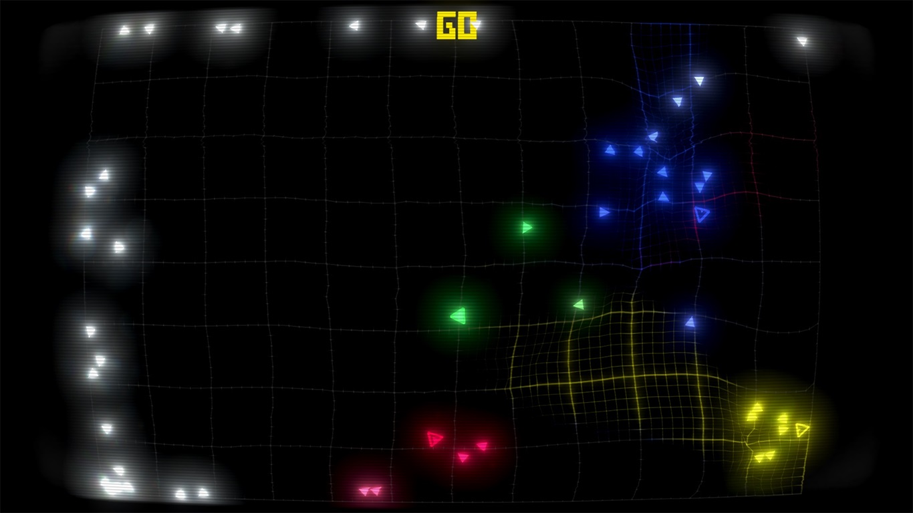

Here are some project ideas that came to my mind once
or more than once. 

I thought about making them but either they're too hard,
or I'm a dorkus who doesn't wanna do anything.

I need to dump those ideas somewhere but I hate writing with my hands.
Maybe someone will find them inspiring and actually do something.

## Abstract shape adventures

Heavily inspired by ENA and the world where nothing makes sense.

That would be a relaxing game where you take a role of
some square that's "not like the others" and can do a shapeshift or change its color.

There might be a story about self-identity and existential thoughts.
Like the square can't naturally fit anywhere cos of its abilities,
or trying to fit requires lots of mental energy and adaptation
so you kinda lose yourself in process just to be like the others.

Gameplay wise there might be something like a mix of puzzles,
platforming (with a reference to geometry dash I guess),
and most importantly absolutely stupid, crazy, and weird dialogues,
cos the game should be abstract.
Since it's inspired by ENA, it doesn't have to make much sense,
but must make you *feel* something.
Like, the story and gameplay is not what's important,
cos what's important is *how you feel in the process*.

Visuals would be something like neon, but dark.
The closest visual inspiration is [Gravity Wars](https://store.steampowered.com/app/877150/Gravity_Wars/)

## Aggressive Melee Swords game

Basically Metal Gear Rising 2 that we'll never get.

A "high-octane action game" about swordsmen doing stuff
in a world that's recovering from a global war
that almost destroyed the like on the whole planet
(clearly a reference to SORA and ULTRAKILL).

Story would be about some guy who likes
to scavenge old tech and reuse it for his own fun.
JETPACKS ARE OBLIGATORY.

Mandatory things to include:

- Robot girl programmed to unconditionally love the owner.
- The crazy owner who wasn't loved enough by his parents
  so "if I can't be happy then nobody will"
  which is the best reason of why villain is evil (it's not).
- Some isolated techy guys who have surpassed the entire humanity
  and started to modify their bodies for higher efficiency
  (Half-Life 2 and PGS reference).
- Trains.
- Reunion of different groups for a common goal.
- Music inspired by [Master Boot Record](https://youtu.be/fZUCxE3hsME)

Basically the story would explore some topics like self-confidence,
mental issues, ethics of robotics and AI, and transhumanism.
(I won't write it cos I hate doing writing). 

All the fights would of course include some
high-tech "compressed-light" swords (Portal 2 light bridge reference)
because it's a melee game + parrying and dashing as core mechanics.
Dunno if it will be a fun gameplay loop but it's just an idea lol.

For funs and giggles, there could be some QTEs,
references to rhythm games or other game genres in general.

The project is too ambitious and
I won't do it alone but it's fun to share.
Maybe someday in like 9999 years I'll start.

## Image Board

Nothing particularly interesting here,
it's just my desire to make a clone for everything but better.

So this image board would be something like danbooru or gelbooru
but with extra features, like better navigation, related images, etc.
Also a thing to avoid duplicates.

I just wanted to host something like this locally to store the best images,
specifically stuff that gets deleted, like 100% OJ arts of my favorite characters.
I just store them as files - completely disorganized and untagged,
so organizing this storage in a personal image board would be nice.

Bonus: I just wanted to host it one a home server
where I could also host Telegram bots or other shit.
Idk why exactly, but I just wanted a home server.

## Anime Pics Filtering AI

An addition to the Image Board project.

I could train some simple AI that takes anime pics and
classifies them into a bunch of different groups.
Basically "rating" them from worst to best to then only choose the best shit
and repost it to the image board described above.

My dudes told me I have a "refined taste"
so instead of manually looking for pics to share to my friends
I could automagically scrap the existing image boards
and apply the magic AI filter.

Would be nice to have a telegram bot that allows
processing all that interactively but I'm lazy as hecc.

~~I could use all those good pics as a learning material.
Maybe I'll learn drawing one day.~~

## AoS2 Replay Filter

Simple command line app (or with some nice GUI)
to filter AoS2 replays based on characters, date,
player nicknames, or something else that I didn't think of.

Reason: AoS2 development is kinda dead and
these replay management features aren't in the game now.
Managing 999 replays (it's max allowed number) is hard especially when
the only tool you have is scrolling up/down one by one.

## Moddable Voxel Game Engine

Inspired by how Factorio works.

Wanted to make some Minceraft clone that would allow for two types of mods:

- Simple Lua Scripts that don't even require restarts.
- Custom DLLs that may alter the engine
  (though I'm not sure how it should work exactly).

But then I realized Minetest exists and it's so unpopular it's almost dead.
Plus the project is again a bit too ambitious for a single lazy developer.

## Clones

Me who wants to make a better clone for every game/tool
goes like "I want that" and never does anything.

Just a bunch of things I wanted to copy (not a full list cos I forgor):

- [Starbound](https://store.steampowered.com/app/211820/Starbound/) (abandonware).
- [Timber and Stone](https://store.steampowered.com/app/408990/Timber_and_Stone/) (abandonware).
- [`isort`](https://pycqa.github.io/isort/) but for Rust
  (cos built-in sorting is weird there).
- Factorio - cos I like it a lot.
- Minecraft - cos everyone must try making it from scratch.

## Spidertron in real life

Obviously inspired by Factorio's Spidertron.

I just wanted to get Arduino and stuff, and then
make a spider that can walk and
be remotely controlled via BluePoop or something.

Sounds simple enough, but making it is way way harder than I expected.
In the end, it's not something I'll try making,
but it's something that would be really epic.

## Minecraft Tech Mod

~~As if there isn't enough tech mods~~

Simply put, I was really inspired by GregTech,
so I wanted to make another tech mod ~~(in Scala)~~.

The mod name? Uhh, you won't believe me but it'd be very,
very original - DocTech. 

Concepts? Idk, machines, energy, logistics.
But I'd definitely go for multiblock machines only
because I think they look really epic.

Other than that, there's not much to say.
I'd also add some decor like cheap, cool-looking, high-tech lamps,
cos most mods lack that. I hate lighting up my base with torches and
glowstone. 
